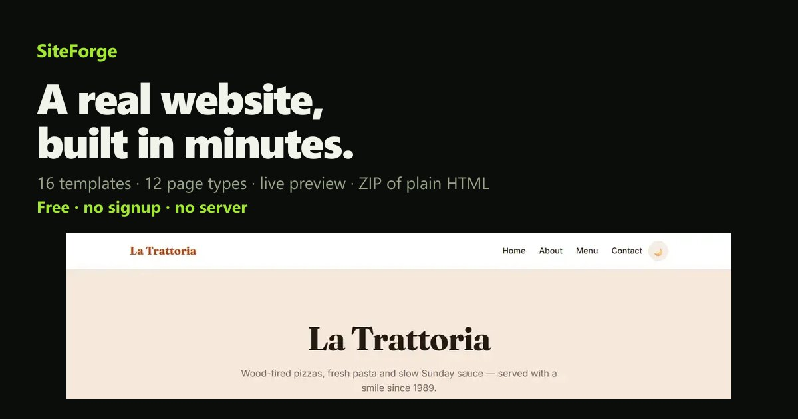

# SiteForge 🛠️



A website builder for non-technical people. Answer a friendly checklist, watch the
site build itself in a live preview, and download a ZIP of plain static HTML —
no accounts, no AI, no backend, **$0 to run**.

- **Live builder:** [muraa-p.github.io/siteforge/app](https://muraa-p.github.io/siteforge/app) · [vercel.app/app](https://siteforge.vercel.app/app) *(whichever your deployment uses — see Deploy below)*
- **Issues & ideas:** [github.com/muraa-p/siteforge/issues](https://github.com/muraa-p/siteforge/issues) — this is where the roadmap gets decided.

> Working title. The stack is deliberately boring and free so the product stays
> cheap as it grows. The MVP foundation is here: **sixteen** templates (eatery,
> portfolio, profile & freelancer, small business, modern studio, clinic &
> hospital, bank & finance, online shop, film & video studio, HR & recruitment,
> creative agency, newsroom & magazine, admin dashboard, fitness coach, SaaS
> landing, law firm), editable color themes, header/footer color overrides,
> image slots, social links, page management, feature toggles, a working shop
> cart, clickable cards that open a detail dialog, live preview and client-side
> ZIP export.

## Run it

```bash
npm install
npm run dev        # → http://localhost:5173
```

## Verify it

```bash
npm run build      # type-checks + production build
npm run smoke      # headless render-engine checks (336 assertions)
npx tsx scripts/gen-sample.ts   # writes real exported sites to ./sample-output
```

The sample exports are written per template: `sample-output/{default, restaurant,
portfolio, profile, business, modern, clinic, bank, shop, films, hr, agency,
newsroom, dashboard, fitness, saas, law}`. `default` is the restaurant-style
template — it works for far more than restaurants (cafés, bakeries, takeaway…).
Each sector template ships real, different pages: clinics get Departments +
Doctors + an appointment page, banks get Accounts (a fee/rate table) + an "Open
an account" page, shops get a product grid *with a working cart*, film studios
get Films + a crew page, HR agencies get job listings, agencies get Work + a
team page, the newsroom gets a lead story + story grid, the dashboard gets KPI
tiles + a reports table, the fitness coach gets **priced Plans** + a booking
page, the SaaS page gets Pricing + FAQ, and the law firm gets Practice areas +
Attorneys + Questions.

## Build your own site from 12 page types

Templates are starting points, not cages. Every template is a set of
**page types**, and the builder lets you add or remove any of them:

| Page | What it shows | Editor it needs |
|---|---|---|
| Home | headline, intro, buttons | hero fields |
| About | your story + photo | about text |
| Menu | things you sell/serve, with prices | items |
| Gallery | photo grid | projects |
| Team | the people | team |
| Booking | request form (appointments/quotes) | — |
| Jobs | open roles | roles |
| **Pricing** | plans/packages/tiers with prices | items |
| **FAQ** | questions + answers (native collapsible) | questions |
| **Testimonials** | client quotes | quotes |
| **News** | posts/articles | projects |
| Contact | details, map, form | contact fields |

Plus unlimited **custom pages** (name it, write it, add a button). The content
editors follow your page choices: add *Pricing* and the plans editor appears;
add *FAQ* and the questions editor appears. Each add-page button explains itself
in a tooltip, in plain English.

Cards are yours to point anywhere: every menu, service, project and team card
has an optional **Button link** — pick any page of your own site or paste any
URL. Leave it empty and the template's sensible default (Book this / Get a
quote / Ask about this) is used.

## Genuinely different layouts (not just paint)

Templates differ in page **structure**, not only colors and text. Each template
picks one of five "chrome" archetypes (researched from real-world template
catalogues — Dimension, Prologue, Story and Massively by HTML5 UP, plus Wix
gallery patterns):

- **`topbar`** — classic sticky top bar (eatery, business, modern, clinic, bank, shop, films, HR, fitness, SaaS, law).
- **`centered`** — no top bar: a slim centred bar (medallion + brand + pill nav) sits above a full-screen logo/title hero (portfolio). The bar is on **every** page, so you can always navigate away.
- **`sidebar`** — a fixed left sidebar with avatar, name, page links and socials, content on the right (profile & freelancer, admin dashboard). Collapses to a hamburger dropdown on phones.
- **`split`** — full-screen statement, then alternating text/visual blocks (creative agency).
- **`editorial`** — centred serif masthead + a bordered nav row, lead story above a dense two-column grid (newsroom & magazine).

On top of the skeleton, each sector gets its own typography and texture: the bank
is institutional (uppercase headline, bordered rate table), films is editorial
(1px rules everywhere, uppercase section heads, serif titles, squared poster
grid), the restaurant sets a warm editorial serif headline with dotted menu
dividers, the fitness coach runs an oversized high-contrast statement over a
tiered Plans grid, the SaaS page centres everything around a product hero, and
the law firm stays restrained and serif-led.

## Things that actually work (no backend)

- **Shop cart** — every product card has *Add to cart*; a floating button opens a
  slide-out drawer with quantity +/− and a live total. Checkout builds a real
  order link: `wa.me` when the WhatsApp feature is on, otherwise a `mailto:`
  with the full itemised order. No payments, no server, no fake "coming soon".
- **Clickable cards** — menu, service, project and team cards are keyboard- and
  click-friendly (`tabindex` + `role="button"`) and open a detail dialog with the
  title, price/role, description and a contextual CTA (book / order / enquire /
  read more). Closes on the X, the backdrop or `Esc`; inner links still win, so
  "Visit project" keeps working.
- **Navigation that never dead-ends** — the centred portfolio bar and the
  editorial masthead render on every page, and the sidebar gets a real hamburger
  on small screens instead of a horizontal scroller.
- **Dark mode, contact form, maps, WhatsApp float** — all still static-only.
- **Plans, FAQ, quotes** — pricing tiers with a highlighted popular plan, a
  collapsible FAQ built on native `<details>` (works with JavaScript disabled),
  and client quotes you can add, edit or delete.

## How it works (the important part)

Every description of a site is one plain JSON object — a `SiteConfig`
(`src/lib/types.ts`). There is **exactly one render function**
(`src/lib/render.ts`) that turns that config into HTML, and it is used for all
three outputs:

| Mode | Used for | Notes |
|---|---|---|
| `file` | the ZIP export | one `.html` per page + `README.txt` |
| `preview` | the live preview iframe | same markup; links are intercepted via `postMessage` so the builder switches pages |
| `app` | "Open preview" in a new tab | single-file build with hash routing (future share links) |

Because preview and export share the same renderer, **what you see is exactly
what you download** — verified by the smoke test.

The one intentional difference is link handling. In the live preview, clicks on
links are handled *inside* the preview: anything pointing at a page of the site
(card CTAs, plan buttons, nav, footer, in-page anchors) switches the preview page
in place, real external links open in a new tab, and nothing is ever allowed to
navigate the preview frame away — otherwise the builder would render a second
time inside the preview pane. If anything ever does escape, the preview pane
detects it and puts the generated site straight back. Exported files are
completely unaffected: they behave like an ordinary static website.

Everything runs in the browser: ZIP export uses `jszip`, preview uses an
`<iframe srcdoc>`, drafts auto-save to `localStorage`.

## Deploy

`npm run build:deploy` produces everything a static host needs in `dist/`:

```
dist/index.html        the landing page        (from landing/)
dist/styles.css        landing styles
dist/shots/*.webp      real template screenshots
dist/og.jpg            social preview image
dist/app/              the builder app         (vite build, base=/app/)
dist/examples/<tpl>/   16 exported sample sites, browsable and clickable
```

The app is a pure static bundle, so **any** host works. Vercel, Netlify and
Cloudflare Pages all deploy it with no configuration beyond the build command
(`npm run build:deploy`) and the output directory (`dist`); `vercel.json` in the
repo already contains those settings. For GitHub Pages, run the same build and
publish `dist/` from a `gh-pages` branch.

`npm run shots` and `npm run og` regenerate the landing-page screenshots and
social card from the real exports (they need the dev server running).

## Stack (all free)

- **Frontend / builder:** React 18 + Vite 8 + TypeScript
- **ZIP export:** jszip (client-side)
- **No backend, no accounts, no keys.** `npm audit`: 0 vulnerabilities.
- When accounts/saving-to-cloud land, the plan is Supabase free
  tier (50k MAU) + Cloudflare Workers/R2 free tier for storage.

## Roadmap

- [x] Sixteen templates (eatery / portfolio / profile / business / modern / clinic / bank / shop / films / HR / agency / newsroom / dashboard / fitness / SaaS / law) with genuinely different layouts & pages + live preview + ZIP export
- [x] Bug round: portfolio nav on every page, mobile sidebar hamburger, working shop cart, clickable cards with a detail dialog
- [x] 12 page types users can add/remove freely (incl. Pricing, FAQ, Testimonials, News) + editors that follow the pages you choose
- [x] Per-card button links (any page of your site or any URL) + plan tiers with a highlighted popular plan
- [x] Preview link handling: card CTAs and plan buttons switch pages in place; the preview frame can never navigate away (no second builder inside the preview)
- [x] Text & button alignment (hero + custom pages) + page-linked buttons
- [x] Header & footer color overrides, main-button text + color
- [x] Image slots (hero bg, about photo, item photos) + social media links
- [x] Dedicated map location (separate from the shown address)
- [ ] AI-assisted copy/images (nothing before this is paid)
- [ ] Builder accounts + saved projects (Supabase free)
- [ ] "Share live preview" links (the `app` mode is ready for this)
- [ ] Paid tier: real hosting + custom domains (when revenue exists)

## Structure

```
src/
  lib/
    types.ts       # SiteConfig data model (one JSON doc = one site)
    templates.ts   # template registry (pages, labels, defaults, layout archetype per template)
    palettes.ts    # 10 color themes, each with light + dark tokens
    render.ts      # the single render engine (file/preview/app modes)
    sample.ts      # sample content per template + normalizeSite migration
    images.ts      # on-device image downscale/encode (data URLs)
    export.ts      # client-side ZIP download
  components/
    Controls.tsx   # the builder dashboard (templates, identity, theme, colors, images, pages, features, content, social, contact, buttons)
    Preview.tsx    # live preview iframe with device toggle + nav interception
    TopBar.tsx     # export / preview / reset
    ui.tsx         # friendly primitives (sections, switches, image/color fields)
scripts/
  smoke.ts           # headless render-engine assertions
  gen-sample.ts      # write the exported sites to ./sample-output
  shots.ts           # screenshot every export for the landing page
  og-image.ts        # build the social preview card + favicon
  prepare-dist.mjs   # assemble the deployable dist/ (landing + app + examples)
  check-deploy.mjs   # assert every landing-page link resolves in dist/
landing/             # the public intro page (plain HTML/CSS, no framework)
```

## Zero-cost principles (decisions so far)

1. **No AI in the critical path.** Templates + config = deterministic generation
   at ~$0 per site. AI (copy/images) is a later, optional, cheap add-on.
2. **No hosted image pipeline.** Images are uploaded on-device, downscaled to a
   compact JPEG data URL, embedded straight in the page and ZIP — no storage to
   pay for. Keep photos under ~1500 px so drafts stay small in localStorage.
3. **Preview = export.** One renderer, no drift, users trust it.
4. **Features must work in static HTML.** Dark mode (CSS vars + localStorage),
   WhatsApp (`wa.me`), map (`maps.google.com` embed, no key), contact form
   (opens the visitor's email app). Real auth/backends are a paid-tier product,
   not an MVP one.